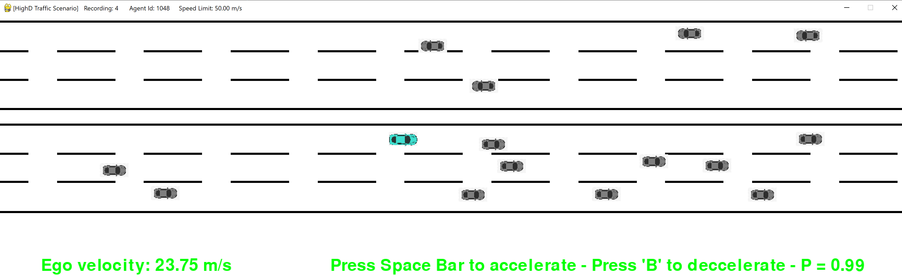

## 2D Driving Simulator Based On HighD Dataset

In this project, we implement a 2D car simulation which is based on real world data. We fetch the driving scenarios from the [HighD](https://www.highd-dataset.com/) dataset. The dataset is proprietory so users should ask for access from the website. The user is given manual control to drive one of the vehicles in  a `pygame` engine.



To run the main code, simply run the following in terminal for the default options:

```
python main.py -p \path_to_highD_dataset 
```

If you want to run a specific agent in a specific recording, run the following:

```
python main.py -recID 10 -agnId 500 -p \path_to_highD_dataset
```

The controls of the vehicle are:
- `right arrow` : move right 
- `left  arrow` : move left
- `up    arrow` : move up 
- `down  arrow` : move down 
- `space   bar` : accelerate 
- `    B      ` : break

